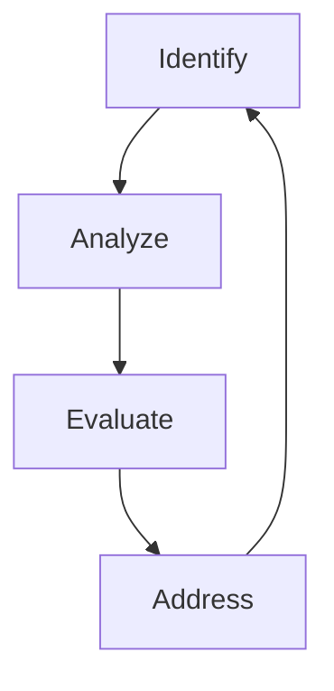

## Foundation 

### **1. INTRODUCTION TO CYBER SECURITY**
  
-  *what is cyber security?*
	- It is used to protect network and devices from attacks or unauthorized access.
	- CIA principles
	
- *Types of attackers*
	- DDOS, Phising,spoofing ,Social engineering attacks
	
- *Risk Management policies:*

	- Different companies may follow different risk management policies these policies are useful to take immediate action when a breach happened in organization or company
	- It is like pre measures and steps to be carried out of breach happened.
	- Standard framework 
		- NIST Cyber Security Framework
			- It contain 108 recommended action across 5 critical security functions.
			- Identify,Protect,Detect ,Respond & Recover.
			
		- ISO/IEC 27001
		- CIS controls

### **2.  NETWORK & SECURITY FUNDAMENTAL**
